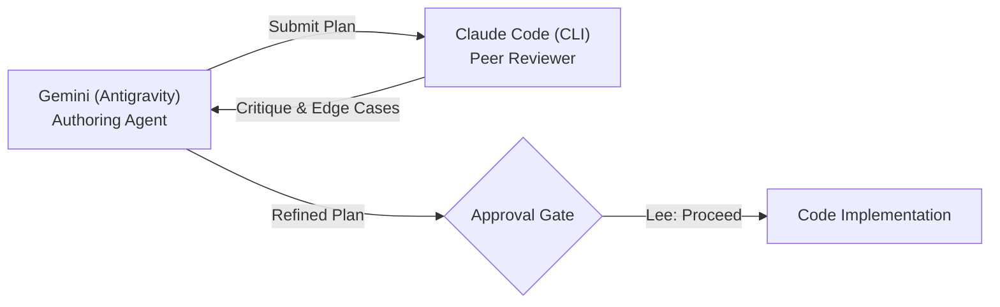

# Truefit Cash Register — Enterprise Financial Engine & Workbench

[](https://www.typescriptlang.org/)
[](https://nodejs.org/)
[](https://react.dev/)
[](https://tailwindcss.com/)
[](https://base-ui.com/)
[](https://vitest.dev/)
[]()

A production-grade, enterprise financial system solving the [Truefit Cash Register Code Assessment](https://github.com/TrueFit/CashRegister). 

This solution delivers an **idiomatic functional TypeScript core** (Domain-Driven Design), a **high-throughput Node.js CLI runner**, and an **interactive Feature-Sliced Design (FSD) React 19 web workbench**. It is engineered to satisfy both the primary business requirements and all extensibility scenarios ("Things to Consider"), accompanied by transparent, audit-ready AI governance documentation.

---

## Table of Contents

1. [Architecture & Design Principles](#architecture--design-principles)
2. [Addressing "Things to Consider"](#addressing-things-to-consider)
3. [Dual-Agent AI Governance](#dual-agent-ai-governance)
4. [Quickstart & Usage](#quickstart--usage)
   - [CLI Runner](#cli-runner)
   - [Interactive Web Workbench](#interactive-web-workbench)
5. [Testing & Invariant Verification](#testing--invariant-verification)
6. [Repository Structure](#repository-structure)
7. [Documentation Index](#documentation-index)
8. [Original Assessment Requirements](#original-assessment-requirements)

---

## Architecture & Design Principles

### 1. Integer Minor-Unit Financial Arithmetic (Zero Floating-Point Drift)
All monetary amounts are represented and calculated strictly in integer minor units (`minorUnits: number`, e.g. `$2.12` $\rightarrow$ `212` cents). Standard IEEE 754 floating-point arithmetic in JavaScript introduces binary rounding artifacts (e.g. `0.1 + 0.2 === 0.30000000000000004`). In a financial register, floating-point drift leads to off-by-one penny errors. Confining all internal calculations to integer cents and isolating conversions at application boundaries guarantees mathematical correctness.

### 2. Pure Functional Domain-Driven Design (DDD)
The core domain (`src/core/`) is isolated from external I/O, Node.js runtime globals, and browser APIs:
- **Branded Types:** Nominal branding (`__brand: 'Money'`, `__brand: 'Currency'`) enforces compile-time type safety.
- **Deep Immutability:** All entities, value objects, distributions, and configurations are frozen (`Object.freeze`).
- **Closure Factories:** Services and register pipelines are instantiated through pure closure-based factories (`createCashRegister`, `createStrategySelector`).

### 3. Feature-Sliced Design (FSD) Web UI
The frontend (`src/web/`) adheres to strict unidirectional FSD layers:
- `shared/`: Tailored Base UI headless button/card/badge/tooltip primitives, Tailwind v4 design tokens, and utility functions.
- `entities/`: Presentation logic for financial domain concepts (`CurrencyBadge`, `TransactionResultRow`).
- `features/`: Discrete user interactions (`CurrencySelector`, `ConfigDrawer`, `SampleLoader`, `FileUploader`, `InputEditor`).
- `widgets/`: Compositional UI modules (`Header`, `Footer`, `RegisterWorkbench`).
- **Hook Placement Standard:** Per project architectural rules, all React custom hooks strictly reside in dedicated `hooks/` directories with `index.ts` export barrels across their respective slices (never in `model/`).
- **Per-Line Twist Caching:** A synchronous ref-based cache keyed by `rerollKey:currencyCode:safeDivisor:rawLine` prevents typing keystrokes from re-randomizing unchanged lines, paired with an on-demand **"Re-roll Twist"** trigger.

---

## Addressing "Things to Consider"

The assessment README specifies three critical design prompts:

| Requirement | Assessment Prompt | Implementation & Design Solution |
| :--- | :--- | :--- |
| **Configurable Divisor** | *"What might happen if the client needs to change the random divisor?"* | The divisor is a first-class configuration parameter in `createStrategySelector({ divisor })`. It defaults to 3, can be changed dynamically in the web UI drawer or programmatic API, and is safely clamped ($\ge 2$). Tested bidirectionally in `tests/core/edgeCases.test.ts`. |
| **Strategy Extensibility** | *"What might happen if the client needs to add another special case?"* | Implemented via the **Strategy Pattern** and **Open/Closed Principle**. New client rules (e.g. VIP thresholds, large purchases) can be injected via `customRules` predicate/strategy objects without modifying or recompiling existing core calculation logic. |
| **French Client (EUR)** | *"What might happen if sales closes a new client in France?"* | Supported via an abstract `Currency` domain interface with first-class implementations for both **USD** and **EUR** (`CURRENCIES.USD`, `CURRENCIES.EUR`), exercising 8 physical Euro coin denominations (`2 euros`, `1 euro`, `50 cents`, `20 cents`, etc.). Swappable in real time in both the CLI and Web UI. |

---

## Dual-Agent AI Governance

This assessment is evaluated not just on final code, but on the transparent, disciplined use of AI tools. Development was conducted under a strict **Dual-Agent Plan Review Rule**:



1. **Gemini in Antigravity:** Authoring agent responsible for architectural formulation, DDD functional refactoring, FSD frontend implementation, and continuous conversation transcripts in `docs/gemini_logs.md`.
2. **Claude Code (`claude -p`):** CLI automated peer review board operating under a 2-loop maximum protocol, surfacing critical edge cases (CRLF line endings, textarea highlight limitations, per-line twist cache churn, composite tsconfig scoping) before code was written. Transcripts maintained in `docs/claude_logs.md`.
3. **Human Engineering Oversight (Lee):** Human-in-the-loop steering directing the refactoring from OOP classes to functional TypeScript (Phase 2.5), establishing the dedicated `hooks/` directory convention, and making final architectural calls.
4. **Honest Accounting of Rejected AI Code:** Transparently documented in [`docs/tool_task_mapping.md`](file:///C:/Users/Lee/Documents/Code%20Sandbox/truefit-assessment-cash-register/docs/tool_task_mapping.md) (rejection of mutable OOP classes, PRNG loop clamping, single CLI exit channels).

---

## Quickstart & Usage

### Prerequisites
- **Node.js:** `v20.0.0` or higher
- **Package Manager:** `pnpm` (`corepack enable pnpm`)

### Installation
```bash
git clone https://github.com/TrueFit/CashRegister.git
cd CashRegister
pnpm install
```

---

### CLI Runner

The CLI runner processes flat files containing `owed,paid` pairs and formats change distributions according to assessment specifications.

#### Basic Usage (Standard Output)
```bash
pnpm run cli sample_input.txt
```

#### Output File Target
```bash
pnpm run cli sample_input.txt output.txt
```

#### Direct Execution via `tsx`
```bash
pnpm exec tsx src/cli/index.ts sample_input.txt
```

#### Sample Input / Output
**Input (`sample_input.txt`):**
```text
2.12,3.00
1.97,2.00
3.33,5.00
```

**Output:**
```text
3 quarters,1 dime,3 pennies
3 pennies
1 dollar,1 quarter,6 nickels,12 pennies
```
*(Line 3 represents a non-deterministic random twist whose sum strictly equals $1.67)*

---

### Interactive Web Workbench

Launch the interactive financial simulator in development mode:
```bash
pnpm run dev
```
Navigate to `http://localhost:5173`.

#### Key Web Features:
- **Monospace Editor with Error Gutter:** Scroll-synchronized line gutter with red indicator dots (`●`) for syntax errors, negative values, or underpayments.
- **Clickable Selection Inspector:** Clicking any error diagnostic instantly calculates the character offset and highlights the token using native selection ranges.
- **Live Currency Switcher:** Toggle between `$ USD` and `€ EUR` instantly.
- **Divisor Configuration Drawer:** Adjust the random twist divisor dynamically with preset quick-picks (3, 5, 7, 10) and live input validation.
- **Drag & Drop Ingestion:** Drop `.txt` or `.csv` flat files directly into the workbench.
- **Matching Result Export:** One-click `.txt` download formatted identically to the CLI runner's output.
- **Twist Stabilization:** Keystrokes on other lines do not re-randomize existing lines; re-sampling is triggered via an explicit "Re-roll Twist" button.

#### Production Build
```bash
pnpm run build
```
Generates an optimized client bundle in `dist/` with zero TypeScript errors.

---

## Testing & Invariant Verification

The solution includes **148 automated tests** across **19 test suites** executed via Vitest:

```bash
# Run all automated tests:
pnpm test

# Run tests with V8 coverage metrics:
pnpm run test:coverage

# Run TypeScript composite project reference typecheck:
pnpm run typecheck

# Run ESLint flat config:
pnpm run lint
```

### Test Coverage Highlights
- **Core Domain (`src/core/domain/`):** 100% Statements, 100% Functions, 100% Lines.
- **Application Layer (`src/core/application/`):** 100% Statements, 100% Functions, 100% Lines.
- **CLI Runner (`src/cli/`):** 100% Statements, 100% Functions, 100% Lines.
- **Web Calculation Hook (`useRegisterCalculation.ts`):** 100% Statements, 100% Branches, 100% Lines.
- **Invariant Stress Testing:** 2,000 automated iterations across USD and EUR asserting that the random change algorithm strictly preserves total value (`sum(count * denomination.value) === changeDue`) with 0 infinite loops.
- **README Golden Master:** End-to-end integration test asserting exact matching against README samples.

---

## Repository Structure

```
.
├── docs/                             # Complete project documentation suite
│   ├── index.md                      # Central documentation directory & map
│   ├── decision_log.md               # 16 Architectural Decision Records (ADRs)
│   ├── tool_task_mapping.md          # AI tool allocation & rejected code accounting
│   ├── self_critique.md              # AI-generated self-critique (Gemini)
│   ├── self_critique_human.md        # Human self-critique (Lee)
│   ├── gemini_logs.md                # Raw prompt transcripts with Gemini
│   ├── claude_logs.md                # Raw prompt transcripts with Claude Code
│   └── plans/                        # Discrete phase plans (Phases 1 through 5)
├── src/
│   ├── core/                         # Domain & Application layers (Zero I/O)
│   │   ├── domain/
│   │   │   ├── currency/             # Money, Denomination, Currency (USD, EUR)
│   │   │   ├── transaction/          # RegisterTransaction, ChangeDistribution
│   │   │   ├── calculation/          # Greedy & Random strategies, CashRegister
│   │   │   └── errors/               # DomainErrors
│   │   └── application/
│   │       ├── parser/               # InputParser with line/column coordinates
│   │       └── formatter/            # ChangeFormatter (zero change, pluralization)
│   ├── cli/                          # Node.js CLI Runner with CliIo injection
│   └── web/                          # Feature-Sliced Design React 19 application
│       ├── shared/                   # Base UI wrappers, cn, Tailwind tokens
│       ├── entities/                 # CurrencyBadge, TransactionResultRow
│       ├── features/                 # Editor, uploader, drawer, currency switch
│       ├── widgets/                  # Header, Footer, RegisterWorkbench (hooks/)
│       ├── pages/                    # RegisterPage
│       └── app/                      # Main entrypoint & theme stylesheet
├── tests/
│   ├── core/                         # Domain, application, and edge case suites
│   ├── cli/                          # CLI runner integration suites
│   └── web/                          # Component, hook, and FSD feature suites
├── package.json
├── tsconfig.json                     # Composite root configuration
├── tsconfig.app.json                 # Web / React project reference
├── tsconfig.node.json                # CLI / Tooling project reference
└── vite.config.ts                    # Vite 8 build & path configuration
```

---

## Documentation Index

| Document | Purpose |
| :--- | :--- |
| [`docs/index.md`](file:///C:/Users/Lee/Documents/Code%20Sandbox/truefit-assessment-cash-register/docs/index.md) | Central entry point and catalog for all documentation. |
| [`docs/decision_log.md`](file:///C:/Users/Lee/Documents/Code%20Sandbox/truefit-assessment-cash-register/docs/decision_log.md) | 16 Architectural Decision Records (ADRs) maintained incrementally. |
| [`docs/tool_task_mapping.md`](file:///C:/Users/Lee/Documents/Code%20Sandbox/truefit-assessment-cash-register/docs/tool_task_mapping.md) | Granular tool allocation and honest accounting of rejected/reworked AI code. |
| [`docs/self_critique.md`](file:///C:/Users/Lee/Documents/Code%20Sandbox/truefit-assessment-cash-register/docs/self_critique.md) | AI-generated self-critique evaluating mathematical strengths and canonical-coin limitations. |
| [`docs/gemini_logs.md`](file:///C:/Users/Lee/Documents/Code%20Sandbox/truefit-assessment-cash-register/docs/gemini_logs.md) | Untruncated, raw prompt and response logs from Gemini in Antigravity. |
| [`docs/claude_logs.md`](file:///C:/Users/Lee/Documents/Code%20Sandbox/truefit-assessment-cash-register/docs/claude_logs.md) | Untruncated, raw peer-review logs from Claude Code. |

---

## Original Assessment Requirements

*(Preserved verbatim from the Truefit repository README)*

### The Problem
Creative Cash Draw Solutions is a client who wants to provide something different for the cashiers who use their system. The function of the application is to tell the cashier how much change is owed, and what denominations should be used. In most cases the app should return the minimum amount of physical change, but the client would like to add a twist. If the "owed" amount is divisible by 3, the app should randomly generate the change denominations (but the math still needs to be right :))

Please write a program which accomplishes the clients goals. The program should:
1. Accept a flat file as input:
   - Each line will contain the amount owed and the amount paid separated by a comma (for example: `2.13,3.00`)
   - Expect that there will be multiple lines
2. Output the change the cashier should return to the customer:
   - The return string should look like: `1 dollar,2 quarters,1 nickel`, etc ...
   - Each new line in the input file should be a new line in the output file

### Sample Input
```text
2.12,3.00

1.97,2.00

3.33,5.00
```

### Sample Output
```text
3 quarters,1 dime,3 pennies

3 pennies

1 dollar,1 quarter,6 nickels,12 pennies
```
*\*Remember the last one is random*

### The Fine Print
Please use whatever technology and techniques you feel are applicable to solve the problem. We suggest that you approach this exercise as if this code was part of a larger system. The end result should be representative of your abilities and style.