# System Architecture — Truefit Cash Register

This document outlines the overarching architectural design of the Truefit Cash Register system. It explains how Domain-Driven Design (DDD), Feature-Sliced Design (FSD), and the Single Responsibility Principle (SRP) are applied to build a robust, extensible, and maintainable solution.

---

## 1. High-Level System Architecture

The application is structured into three primary tiers:

```mermaid
graph TD
    subgraph Core Domain [src/core/domain/ - DDD]
        Money[Money Value Object]
        Denom[Denomination Value Object]
        Currency[Currency Entity]
        Tx[RegisterTransaction Value Object]
        Dist[ChangeDistribution Value Object]
        
        Strat[IChangeCalculationStrategy]
        MinStrat[GreedyMinimumChangeStrategy]
        RandStrat[RandomChangeStrategy]
        Strat --> MinStrat
        Strat --> RandStrat
        
        Selector[StrategySelector Service]
        Register[CashRegister Service]
    end

    subgraph Application Layer [src/core/application/ - DDD]
        Parser[InputParser - Positional Diagnostics]
        Formatter[ChangeFormatter - String Renderer]
    end

    subgraph Delivery & Infrastructure
        CLI[Node.js CLI Runner - src/cli/]
        Web[React FSD Web App - src/web/]
    end

    CLI --> Parser
    CLI --> Register
    CLI --> Formatter

    Web --> Parser
    Web --> Register
    Web --> Formatter
```



---

## 2. Core Domain Layer: Domain-Driven Design (DDD)

The core domain (`src/core/domain/`) contains pure business logic. It has zero external dependencies, zero React dependencies, and zero Node.js I/O dependencies. It can run in any JavaScript/TypeScript runtime (Node, browser, edge worker).

### Ubiquitous Language & Domain Concepts
- **`Money` (Value Object):** Represents a monetary amount strictly in integer minor units (e.g. cents). Eliminates IEEE 754 floating-point rounding bugs. Immutable.
- **`Denomination` (Value Object):** Represents a physical unit of money (e.g., Dollar = 100 minor units, Quarter = 25 minor units) with singular and plural naming.
- **`Currency` (Value Object & Static Registry):** Immutable reference data defining a monetary system (e.g. `Currencies.USD`, `Currencies.EUR`) with its symbol and ordered descending list of denominations. Enforces a structural termination invariant: the denomination set must have `gcd === 1` and include an atomic unit-value denomination (1 cent / 1 penny).
- **`RegisterTransaction` (Value Object):** Encapsulates a transaction line (`owed: Money`, `paid: Money`). Computes `changeDue: Money` and solely enforces the business invariant that `paid >= owed` (throwing `UnderpaidError` on violation).
- **`ChangeDistribution` (Value Object):** Holds the resulting denomination breakdown, keyed by stable identifier. Enforces the invariant: `sum(count * denomination.value) === changeDue`.
- **`IChangeCalculationStrategy` (Domain Strategy):** Encapsulates change distribution logic.
  - `GreedyMinimumChangeStrategy`: Canonical greedy algorithm returning minimal physical coin/bill count.
  - `RandomChangeStrategy`: Generates valid randomized distributions with mathematically guaranteed termination.
- **`StrategySelector` (Domain Service):** Determines which strategy applies for a transaction by iterating an extensible predicate registry array (`Array<{ predicate: (tx: RegisterTransaction) => boolean, strategy: IChangeCalculationStrategy }>`), with `GreedyMinimumChangeStrategy` as the default fallback.
- **`CashRegister` (Domain Service / Aggregate Coordinator):** Coordinates the transaction lifecycle, delegating to `StrategySelector` and executing the chosen strategy.

---

## 3. Application Layer: Parser & Formatter (DDD)

Located in `src/core/application/`:
- **`InputParser`:** Responsible for transforming raw multi-line strings into validated `RegisterTransaction` instances. Tracks precise line numbers, start columns, and end columns for all syntax and domain validation errors.
- **`ChangeFormatter`:** Responsible for converting a `ChangeDistribution` into the required comma-separated string representation (e.g. `1 dollar,2 quarters,1 nickel` or `"0"`).

---

## 4. Web Frontend: Feature-Sliced Design (FSD)

The web frontend (`src/web/`) strictly adheres to Feature-Sliced Design (FSD). Dependency flow is strictly unidirectional from upper layers to lower layers:

```
app (Top level)
 └── pages
      └── widgets
           └── features
                └── entities
                     └── shared (Bottom level)
```

### Layer Breakdown
1. **`app/`:** Root application wrapper, global styling, Tailwind initialization, and layout shell.
2. **`pages/` (`register-page`):** Composition of the workbench page.
3. **`widgets/` (`register-workbench`):** Orchestrates the editor, error diagnostic gutter, control toolbar, and results breakdown.
4. **`features/`:** User interactions with distinct business goals:
   - `input-editor`: Real-time text editing with line numbers and error indicators.
   - `file-upload`: Flat-file drag-and-drop ingestion.
   - `currency-switch`: Toggling between USD and EUR.
   - `config-settings`: Interactive adjustment of the random divisor (e.g. changing 3 to 5).
   - `sample-loader`: One-click loading of sample scenarios and edge cases.
5. **`entities/`:** View-adapters that import domain models directly from `@core/domain/model` and provide UI presentation components; they never re-declare domain rules:
   - `transaction`: Transaction row preview and change breakdown chips.
   - `currency`: Currency badges and denomination pills.
6. **`shared/`:** UI kit built on Base UI (`@base-ui/react`) and Tailwind CSS primitives:
   - Base UI Button, Dialog, Tooltip, Card, Tabs, Input, and styling helper `cn()`.

---

## 5. Single Responsibility Principle (SRP) Matrix

Every class, service, and module in both backend and frontend has one single reason to change:

| Module / Component | Layer | Single Responsibility | Reason to Change |
| :--- | :--- | :--- | :--- |
| `Money` | Domain | Immutable cent math and comparisons | Changes to monetary arithmetic rules |
| `Denomination` | Domain | Physical unit metadata & naming | Changes to denomination representation |
| `Currency` | Domain | Currency definition & denomination registry | Adding or reconfiguring a currency |
| `GreedyMinimumChangeStrategy` | Domain | Optimal coin minimization algorithm | Changes to minimum-coin algorithm |
| `RandomChangeStrategy` | Domain | Valid non-deterministic coin distribution | Changes to randomization weighting |
| `StrategySelector` | Domain | Rule evaluation and strategy routing | Changing divisor or adding new special rules |
| `CashRegister` | Domain | Coordinating transaction computation | Changes to register processing flow |
| `InputParser` | Application | Lexical parsing & positional error tracking | Changes to input flat-file specification |
| `ChangeFormatter` | Application | Comma-separated string rendering | Changes to output string format |
| `CliRunner` | Infrastructure | CLI argument handling & file I/O | Changes to CLI flags or terminal I/O |
| `InputEditor` | Web Feature | Textarea editing & line/col error highlighting | Changes to editor UI or caret mechanics |
| `FileUploader` | Web Feature | File dropzone handling | Changes to drag-and-drop UX |
| `RegisterWorkbench` | Web Widget | Layout coordination of editor & results | Changes to workbench arrangement |

---

## 6. System Invariants & Guarantees

1. **Integer Arithmetic Guarantee:** No floating-point math occurs in money calculations. All values are integer minor units.
2. **Total Sum Invariant:** For every `ChangeDistribution`, `sum(count * denomination.value) === changeDue`. Rejects any invalid distribution.
3. **Termination Guarantee:** The random strategy terminates in finite steps because the candidate denomination set includes the atomic 1-cent denomination.
4. **Boundary Isolation:** Domain logic cannot import from `src/web/` or Node-specific libraries (`fs`, `process`).
